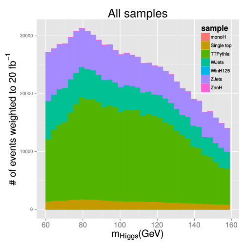

## Input samples

We now have the [Phys14](https://github.com/arizzi/cmssw/blob/vhbbHeppy722patch2/VHbbAnalysis/Heppy/test/crab/datasets.txt) and signal productions ntuplized: 

 * TTBar (TT_Tune4C_13TeV-pythia8-tauola)
 * ZJetsToNuNu (HT: 100to200, 200to400, 600toInf) 
 * WJetsToLNu (inclusive, HT: 100to200, 200to400, 400to600)
 * ZH_HToBB_ZToNuNu
 * WH_HToBB_WToLNu
 * QCD (HT: 100To250, 250To500, 500To1000, 1000ToInf)
 * Single Top (T_t, Tbar_t, T_tW, Tbar_tW, T_s, Tbar_s)
 * mono-Higgs model with new scalar ($m_{\chi} = 1~GeV$, $m_{sc} = 100~GeV$, $sin(\theta) = 0.3$)

--- &twocol

## The Higgs boson mass distribution

*** =left

*** =right

*** =fullwidth

