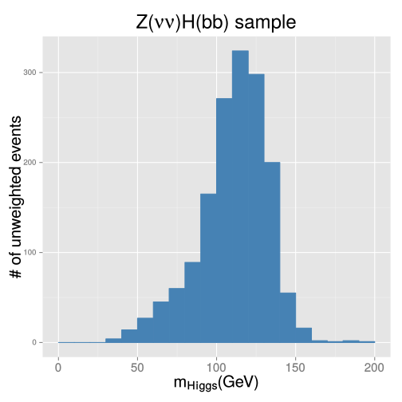
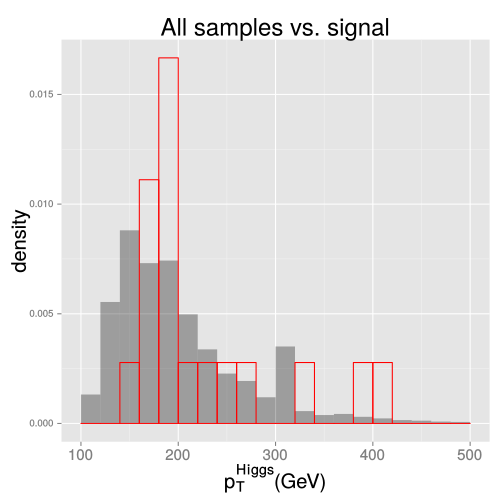

## Motivation for the mono-higgs search

<br>

Experimentalist's view:

 * Higgs boson is the least studied SM object that may show us an interesting behavior
 * The $VH$ SM process has still [not yet been reliably observed](http://dx.doi.org/10.1103/PhysRevD.89.012003) (only $\sim 2 \sigma$ excess seen)
 * The mono-$X$ signatures is a general approach to look for the Dark Matter at colliders

<br>

Theorist's view (in my view):

 * Corrections to Higgs boson mass can be canceled by yet unknown (invisible) particles
 * Higgs is perfect "hook" to introduce new fields with [renormalizable couplings](http://arxiv.org/pdf/hep-ph/0605188v1.pdf) to SM
[[1](https://indico.cern.ch/event/349613/session/9/contribution/5/material/slides/0.pdf), 
[2](http://arxiv.org/pdf/hep-ph/0612275v2.pdf), [3](http://en.wikipedia.org/wiki/Two-Higgs-doublet_model)]

--- .class #id


## Scalar model of the [1312.2592](http://arxiv.org/abs/1312.2592)

Introduce Dark Matter $\chi$ coupled to a new scalar singlet $S$:

\[ \mathcal{L} \sim -y_\chi \bar{\chi}\chi S \]

$S$ can be introduced to the SM at the renormalizable level via interaction with the Higgs boson:

\[ V \sim a |H|^2 S + b |H|^2 S^2 + \lambda_h |H|^4 = \frac{1}{2} a (h + v)^2 S + \frac{1}{2} b (h + v)^2 S^2 + \frac{\lambda_h}{4}(h+v)^4 \]

Diagonalizing mass matrix via mixing $~~h \rightarrow c_\theta h + s_\theta S~~$  and  $~~S \rightarrow c_\theta S - s_\theta h~~$  gives us:

\[ \mathcal{L} \sim -y_\chi \bar{\color{red}\chi}\color{red}\chi (c_\theta S - s_\theta \color{red}h) - \frac{m_q}{v}\bar{\color{brown}q}\color{brown}q(c_\theta h + s_\theta \color{brown}S) \]
(note: we now have <span style="color:red">invisible higgs decay</span> and <span style="color:brown">Yukawa coupling of $S$ to SM</span>, suppressed by $s_\theta$)

And an additional interaction terms (where $sin(\theta) \equiv s_\theta = 2 a v /(m^2_S - m^2_h)$):

\[ V^{cubic} \approx \frac{sin(\theta)}{v} (2 m^2_h + m^2_S) h^2 S + \frac{m^2_S}{v} h S^2 + ... \]

--- .class #id


## Observations on the model

<br>

The important physics phenomena come from the $H-S$ mixing alone:
 * Mixing opens direct invisible Higgs boson decay channel (if $m_H > 2 m_\chi$)
  * it should be consistent with direct [($\mathcal{B} < 0.6$)](http://dx.doi.org/10.1140/epjc/s10052-014-2980-6)
and indirect [($\mathcal{B}<0.38$)](http://dx.doi.org/10.1016/j.physletb.2014.06.077) bounds
  * it allows for the invisible $H$ + ISR jet (mono-jet) signature that is also rather [constrained](http://arxiv.org/pdf/1408.3583v1.pdf#10)
 * Mixing generates Yukawa couplings for $S$ and SM quarks thus giving us di-jet signature
  * the current [di-jet limits](http://dx.doi.org/10.1103/PhysRevD.91.052009) also apply

<br>

The interaction potential $V^{cubic}$ also generates invisible $H$ and mono-$H$ signatures

The mono-$H$ contribution of $V^{cubic}$ gains significance when $~m_H < 2 m_\chi~$, but $~2 m_\chi < m_S~$

--- .class #id


## The model parameters

Let us start with the parameters from the original paper:

1. Dark matter candidate mass: $m_\chi = 1~GeV - 100~GeV$
2. New scalar mediator mass: $m_S = 100~GeV~(1000~GeV)$
3. Higgs-scalar mixing angle: $sin(\theta) = 0.3~$ (still consistent with the current Higgs data)
4. Higgs-scalar Yukawa coupling to DM: $y_\chi = 0.5$

Parameters from 3 and 4 are trivial:

 * cross section is proportional to $sin^2(\theta)$ and $y_{\chi}^2$

 * these parameters do not change kinematics

Mono-higgs cross section: $\sigma(pp > h~ chi~ chi\tilde~ ) = 0.126~pb$

Invisible cross section: $\sigma(pp~ >~ chi~ chi\tilde~ ) = 350~pb~$

--- &twocol


## Mono-higgs diagrams and exclusive cross sections

*** =left

 

\[ \small \sigma(pp > h > h~ chi~ chi\tilde~ / chi~ chi\tilde~~ sc ) \sim 10^{-1}~pb \]


\[ \small \sigma(pp > h~ chi~ chi\tilde~~ HIG=2) \sim 10^{-4}~pb \]

*** =right


\[ \small \sigma(pp > sc > h~ chi~ chi\tilde~ ) \sim 10^{-3}~pb \]

 

\[ \small \sigma(pp > chi > h~ chi~ chi\tilde~ ) \sim 10^{-8}~pb \]

*** =fullwidth

--- &twocol


## Mono-higgs production cross section

The top two diagrams from the previous slide are relevant for the two kinematic regions:

<!-- * $m_\chi > max\{ \frac{m_h}{2}, \frac{m_S}{2} \}$: kinematically suppressed, not considering further -->

*** =left
 * $m_\chi < \frac{m_h}{2}$: leading contribution comes from the diagram with $h \rightarrow \bar{\chi}\chi~$ ($\forall~m_S$)

```{r nvd3plot, results = 'asis', comment = NA, message = F, echo = F}
require(rCharts)
mass <- c(1, 10, 20, 30, 40, 50, 60)
rate <- c(0.126, 0.122, 0.108, 0.085, 0.057, 0.027, 0.003)
d <- data.frame(mass=mass, rate=rate)
p1 <- rPlot(rate ~ mass, data = d, type = 'point')
p1$set(width  = 450)
p1$set(height = 350)
p1$set(title = "Cross section (pb)")
p1$guides(
  x = list(
    min = 0,
    max = 65,
    numticks = length( d$mass ),
    labels = d$mass,
    title = "m_chi (GeV)"
  ),
  y = list(
    min = -0.001,
    max = 0.13
  )
)
p1$show('inline')
```

*** =right

 * $\frac{m_h}{2} < m_\chi < \frac{m_S}{2}$: leading contribution is due to $S \rightarrow \bar{\chi}\chi$ (assume $m_S = 1~TeV$)

```{r results = 'asis', comment = NA, message = F, echo = F}
mass2 <- c(70,      80,      90,      100,     200,     300,     400)
rate2 <- c(0.00149, 0.00148, 0.00146, 0.00144, 0.00118, 0.00078, 0.00033)
d2 <- data.frame(mass=mass2, rate=rate2)
p2 <- rPlot(rate ~ mass, data = d2, type = 'point')
p2$set(width  = 450)
p2$set(height = 350)
p2$set(title = "Cross section (pb)")
p2$guides(
  x = list(
    min = 60,
    max = 410,
    numticks = length( d$mass ),
    labels = d$mass,
    title = "m_chi (GeV)"
  ),
  y = list(
    min = 0.0003,
    max = 0.00155
  )
)
p2$show('inline')
```

*** =fullwidth

--- &twocol


## Heavy dark matter ($m_h/2 < m_\chi < m_S/2$)

Once Higgs no longer dominates production, the phenomenology becomes interesting:

*** =left

```{r results = 'asis', comment = NA, message = F, echo = F}
r <- data.frame(mass=numeric(),rate=numeric(),process=character())
r <- rbind(r, data.frame(mass=c(200), rate=c(0.00622), process='invisible H') )
r <- rbind(r, data.frame(mass=c(200), rate=c(0.000498), process='mono-Higgs') )
r <- rbind(r, data.frame(mass=c(300), rate=c(0.00513), process='invisible H') )
r <- rbind(r, data.frame(mass=c(300), rate=c(0.0012), process='mono-Higgs') )
r <- rbind(r, data.frame(mass=c(400), rate=c(0.00366), process='invisible H') )
r <- rbind(r, data.frame(mass=c(400), rate=c(0.0015), process='mono-Higgs') )
r <- rbind(r, data.frame(mass=c(500), rate=c(0.00292), process='invisible H') )
r <- rbind(r, data.frame(mass=c(500), rate=c(0.00166), process='mono-Higgs') )
r <- rbind(r, data.frame(mass=c(600), rate=c(0.00255), process='invisible H') )
r <- rbind(r, data.frame(mass=c(600), rate=c(0.00174), process='mono-Higgs') )
r <- rbind(r, data.frame(mass=c(700), rate=c(0.00235), process='invisible H') )
r <- rbind(r, data.frame(mass=c(700), rate=c(0.00173), process='mono-Higgs') )
r <- rbind(r, data.frame(mass=c(800), rate=c(0.00224), process='invisible H') )
r <- rbind(r, data.frame(mass=c(800), rate=c(0.00168), process='mono-Higgs') )
p3<- rPlot(rate ~ mass, group=c('process'), data = r, type = 'point', color = 'process')
p3$set(width  = 450)
p3$set(height = 350)
p3$set(title = "Cross section (pb)")
p3$guides(
  x = list(
    min = 150,
    max = 850,
    numticks = length( r$mass ),
    labels = r$mass,
    title = "m_scalar (GeV)"
  ),
  y = list(
    min = -0.0001,
    max = 0.007
  )
)
p3$show('inline')
```

*** =right


*** =fullwidth

Heavy mediator increases the cross section (note $V^{cubic}$ in slide 3), but it is still $\sim fb$


--- .class #id


## Phenomenological summary for the scalar model

The production cross section of the mono-higgs and mono-jet processes:
 * $\sigma_{mono-X} \sim sin^2(\theta) \cdot y^2_\chi$
 * $\sigma_{mono-X} \sim (1 - 4 m^2_\chi / M^2_{mediator} )$ for phase space

The event kinematics of the mono-higgs and mono-jet processes:
 * $m_\chi < \frac{m_h}{2}$: independent of any model parameter
 * $\frac{m_h}{2} < m_\chi < \frac{m_S}{2}$: depends on $~m_S~$

Mono-jet event signature offers more power to constrain the model compared to mono-higgs:

signature   | production rate                                            | current limit
------------|------------------------------------------------------------|--------------
mono-jet    | $\sigma \times \epsilon(E_{T}^{miss} > 500~GeV) = 0.35~pb$ | [$0.01~pb$](http://arxiv.org/pdf/1408.3583v1.pdf#10)
mono-higgs  | $\sigma \times \epsilon(E_{T}^{miss} > 100~GeV) = 0.04~pb$ | N/A


--- .class #id


## Mono-higgs analysis strategy

<br>

Event signature: $E^{miss}_T + H(\rightarrow b\bar{b})$
 * select events with $E^{miss}_T$ and two $b$-jets (at least)
 * reconstruct $H$ peak

Main backgrounds: QCD, TTBar, WJets, ZJets, ZH (irreducible)
 * model TTBar with Monte Carlo
 * measure VJets, QCD(?), and ZH from data

Limit setting
 * look for excess over the SM ZH background

--- .class #id


## Signal and backgrounds in full simulation

<br>

We have the [Phys14](https://github.com/arizzi/cmssw/blob/vhbbHeppy722patch2/VHbbAnalysis/Heppy/test/crab/datasets.txt) and signal productions ntuplized: 

 * TTBar (<span style="font-weight:bold;font-size:smaller;color:brown">TT_Tune4C_13TeV-pythia8-tauola</span>)
 * ZJetsToNuNu (HT: <span style="font-weight:bold;font-size:smaller;color:brown">100to200, 200to400, 400to600, 600toInf</span>) 
 * WJetsToLNu (inclusive, HT: <span style="font-weight:bold;font-size:smaller;color:brown">100to200, 200to400, 400to600, 600toInf</span>)
 * ZH_HToBB_ZToNuNu
 * WH_HToBB_WToLNu
 * QCD (HT: <span style="font-weight:bold;font-size:smaller;color:brown">100To250, 250To500, 500To1000, 1000ToInf</span>)
 * Single Top (<span style="font-weight:bold;font-size:smaller;color:brown">T_t, Tbar_t, T_tW, Tbar_tW, T_s, Tbar_s</span>)
 * mono-Higgs model with new scalar (<span style="font-weight:bold;font-size:smaller">$m_{\chi} = 1~GeV$, $m_{sc} = 100~GeV$, $sin(\theta) = 0.3$</span>)

--- .class #id


## Selection

Inspired by the [$VH$](http://dx.doi.org/10.1103/PhysRevD.89.012003) analysis:

 * $E_{T}^{miss} > 150~GeV$
 * Higgs jets: $p_{T} > 80, 30~GeV$, with tight and medium CSV tags (0.898, 0.679 discriminators)
 * no isolated leptons with $p_T > 20~GeV$
 * $dR(bb)<1.3$ selects relatively boosted $H$
 * $|d\phi(E_{T}^{miss},\forall Jet)| < 1.5$ suppresses QCD
 * no more that one additional jet with $p_{T} > 30~GeV$ and $|\eta| < 2.4$

$H \rightarrow bb$ reconstruction options:
 * jet pair with highest $p_T$
 * jet pair with highest $b$-tag discriminators 


--- &twocol

## Higgs boson mass from the highest $p_T$ jet pair

*** =left



*** =right


*** =fullwidth

A reasonable mass cut around $\sim 90-140~GeV$ can suppress backgrounds by factor of 2


--- &twocol

## Higgs boson mass from the jet pair with highest CSVs 

*** =left


*** =right


*** =fullwidth

Not much difference wrt. the previous slide $\rightarrow$ use highest di-jet $p_T$ selection by default


--- &twocol

## $E^{miss}_T$ and $p^{higgs}_T$ distributions

*** =left


*** =right


*** =fullwidth

Main backgrounds are TTBar, ZJets, and WJets; signal yeild is 20-30% of Z(nn)H

--- &twocol

## Discriminating power

*** =left


*** =right



*** =fullwidth

Signal is slightly harder than the backgrounds

--- .class #id


## Summary

Theory-wise mono-higgs scalar model seems to be a well-motivated scenario:
 * it is a renormalizable way to extend the SM
 * it couples DM with Higgs boson

Analysis-wise the model seem a pretty challenging enterprise:
 * signal yield is minuscule (20-30% of irreducible Z(nn)H that is not yet observed)
 * kinematic spectra do not offer a very good discrimination
 * the backgrounds have to be measured directly from data

