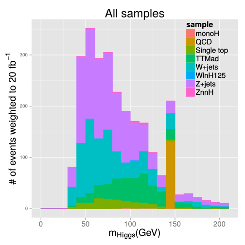
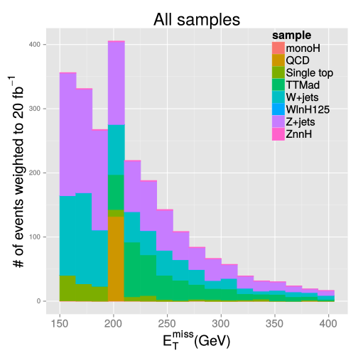
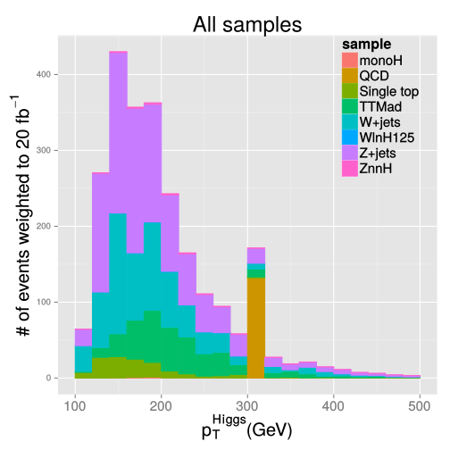

## Motivation for the mono-higgs search

 

Experimentalist's view:

 * Higgs boson is the least studied SM object that may show us an interesting behavior
 * The $VH$ SM process has still [not yet been reliably observed](http://dx.doi.org/10.1103/PhysRevD.89.012003) (only $\sim 2 \sigma$ excess seen)
 * The mono-$X$ signatures is a general approach to look for the Dark Matter at colliders

 

Theorist's view (in my view):

 * Corrections to Higgs boson mass can be canceled by yet unknown (invisible) particles
 * Higgs is perfect "hook" to introduce new fields with [renormalizable couplings](http://arxiv.org/pdf/hep-ph/0605188v1.pdf) to SM
[[1](https://indico.cern.ch/event/349613/session/9/contribution/5/material/slides/0.pdf), 
[2](http://arxiv.org/pdf/hep-ph/0612275v2.pdf), [3](http://en.wikipedia.org/wiki/Two-Higgs-doublet_model)]

--- .class #id

## Scalar model of the [1312.2592](http://arxiv.org/abs/1312.2592)

Introduce Dark Matter $\chi$ coupled to a new scalar singlet $S$:

\[ \mathcal{L} \sim -y_\chi \bar{\chi}\chi S \]

$S$ can be introduced to the SM at the renormalizable level via interaction with the Higgs boson:

\[ V \sim a |H|^2 S + b |H|^2 S^2 + \lambda_h |H|^4 = \frac{1}{2} a (h + v)^2 S + \frac{1}{2} b (h + v)^2 S^2 + \frac{\lambda_h}{4}(h+v)^4 \]

Diagonalizing mass matrix via mixing $~~h \rightarrow c_\theta h + s_\theta S~~$  and  $~~S \rightarrow c_\theta S - s_\theta h~~$  gives us:

\[ \mathcal{L} \sim -y_\chi \bar{\color{red}\chi}\color{red}\chi (c_\theta S - s_\theta \color{red}h) - \frac{m_q}{v}\bar{\color{brown}q}\color{brown}q(c_\theta h + s_\theta \color{brown}S) \]
(note: we now have invisible higgs decay and Yukawa coupling of $S$ to SM, suppressed by $s_\theta$)

And an additional interaction terms (where $sin(\theta) \equiv s_\theta = 2 a v /(m^2_S - m^2_h)$):

\[ V^{cubic} \approx \frac{sin(\theta)}{v} (2 m^2_h + m^2_S) h^2 S + \frac{m^2_S}{v} h S^2 + ... \]

--- .class #id

## Observations on the model

The important physics phenomena come from the $H-S$ mixing alone:
 * Mixing opens direct invisible Higgs boson decay channel (if $m_\chi < m_H/2$):
  * should be consistent with direct [($\mathcal{B} < 0.6$)](http://dx.doi.org/10.1140/epjc/s10052-014-2980-6)
and indirect [($\mathcal{B}<0.38$)](http://dx.doi.org/10.1016/j.physletb.2014.06.077) bounds
  * allows for the invisible $H$ + ISR jet (mono-jet) signature that is rather [constrained](http://arxiv.org/pdf/1408.3583v1.pdf#10)
 * Mixing generates Yukawa couplings for $S$ and SM quarks thus producing di-quark decays
  * for light quarks the $\sim m_q/v$ coupling makes the current [di-jet limits](http://dx.doi.org/10.1103/PhysRevD.91.052009) irrelevant
  * [$t\bar{t}$ resonance](http://dx.doi.org/10.1103/PhysRevLett.111.211804) search is also not sufficiently sensitive to constrain the model

 

Potential $V^{cubic}$ generates invisible $H$ and mono-$H$ signatures as well

The mono-$H$ contribution of $V^{cubic}$ gains significance if $~m_\chi > m_H / 2~$, but $~m_\chi < m_S / 2~$

--- .class #id

## The model parameters

Parameters from the original paper:

1. Dark matter candidate mass: $m_\chi = 1 - 1000~GeV$
2. New scalar mediator mass: $m_S = 100~GeV~(1000~GeV)$
3. Higgs-scalar mixing angle: $sin(\theta) = 0.3~$
4. Higgs-scalar Yukawa coupling to DM: $y_\chi = 0.5$
5. Coupling $b = 3~$ (is present only in $V^{cubic}$ term)

<!--Calculated Higgs width at $m_\chi = 1~GeV~$ is $\sim 0.1~GeV~$ (dominated by the invisible decay)-->

Take $y_\chi = 0.2~$ in order to have Higgs width within [the $\sim 22~MeV~$ LHC Run I constraint](http://dx.doi.org/10.1016/j.physletb.2014.06.077)
 * $y_\chi$ does not change kinematics (neither do $sin(\theta)$ or $b$)
 * $\Gamma_{H} = \Gamma_{H}^{SM} + \Gamma_{H \rightarrow \chi \bar{\chi}}$ and $\Gamma_{H \rightarrow \chi \bar{\chi}} \sim y^2_\chi~$ (as well as $\Gamma_S \sim \Gamma_{S \rightarrow \chi \bar{\chi}} \sim y^2_\chi$)
 * for processes with $\chi\bar{\chi}~$: $\sigma_{\chi\bar{\chi}} \sim y_{\chi}^2 / \Gamma_{mediator}$ (i.e. cross section depends weakly on $y_{\chi}^2$)

--- &twocol

## Invisible DM production

Even if $m_S \sim m_H~$, $\Gamma_S \gg \Gamma_H$ and $S$ is not interchangeable with $H$ for calculating $\sigma$

Let us take $m_\chi = 1~GeV~$, $m_S = 100~GeV~$:

*** =left

 

\[ \small \sigma(pp > h > chi~ chi\tilde~ ) \sim 84\% \]

*** =right

\[ \small \sigma(pp > sc > h~ chi~ chi\tilde~ ) \sim 16\% \]

*** =fullwidth

Three kinematic regions:
 * $m_\chi < \frac{m_h}{2}$: production is dominated by the Higgs boson invisible decay
 * $\frac{m_h}{2} < m_\chi < \frac{m_S}{2}$: leading contribution is due to $S \rightarrow \bar{\chi}\chi$
 * $m_\chi > max\{ \frac{m_h}{2}, \frac{m_S}{2} \}$: production is kinematically suppressed

--- &twocol

## Mono-higgs DM production without $\small V^{cubic}$

Leading diagrams with $H \rightarrow \chi\bar{\chi}$ (left) and $S \rightarrow \chi\bar{\chi}$ (right) processes:

*** =left

<!-- generate g g > h > h chi chi~ HIW=0 QCD=0 QED=1 HIG=2 -->

 

\[ \sigma \sim 3 \cdot 10^{-2}~pb~ (\sim 85\%) \]

*** =right

<!-- generate g g > sc > h chi chi~ HIW=0 QCD=0 QED=1 HIG=2 -->

 

\[ \sigma \sim 5 \cdot 10^{-3}~pb~ (\sim 15\%) \]

*** =fullwidth

--- &twocol

## Mono-higgs DM production from $\small V^{cubic}$ term

*** =left

<!-- generate g g > sc > h chi chi~ / chi chi~ HIW=0 QCD=0 QED=2 HIG=1 -->

 

Independent of $b$, $\sigma \sim 2 \cdot 10^{-3}~pb$

*** =right

<!-- generate g g > sc > h chi chi~ / chi chi~ h HIW=0 QCD=0 QED=2 HIG=1 -->

Depends on $b$, e.g. $\sigma(b = 3) \sim 3 \cdot 10^{-2}~pb$

(may be comparable to $\sigma(non-V^{cubic})$)

Each diagram on this slide has a coupling proportional to $m_S^2 ~\rightarrow~$
for heavy $S$ they become very competitive

*** =fullwidth

--- .class #id

## Production rate of light DM ($\small m_\chi < m_h/2$)

 * Mono-higgs cross section: $\sigma(pp > h~ chi~ chi\tilde~ ) = 0.03~pb$
 * Invisible cross section: $\sigma(pp~ >~ chi~ chi\tilde~ ) = 14.5~pb~$

Ratio of the two is roughly independent on $m_\chi$

<!--Leading contributions include $H \rightarrow \chi\bar{\chi}~$ process-->

Mono-jet event signature is as powerful as mono-higgs for constraining the model:

signature   | detection  rate                                             | current limit
------------|-------------------------------------------------------------|--------------
mono-jet    | $\sigma \times \epsilon(E_{T}^{miss} > 500~GeV) = 0.015~pb$ | [$0.01~pb$](http://arxiv.org/pdf/1408.3583v1.pdf#10)
mono-higgs  | $\sigma \times \epsilon(E_{T}^{miss} > 100~GeV) = 0.01~pb$  | N/A

 

Kinematics changes (e.g. higher $E^{miss}_T$) once $V^{cubic}$ enters the game for heavy $S$

If $m_S \sim m_H$, only $b \gtrsim 3$ handle increases rate of mono-higgs independently of mono-jet

--- &twocol

## Heavier dark matter ($\small m_h/2 < m_\chi < m_S/2$)

*** =left

*** =right

*** =fullwidth

Production rate drops below interesting values ("shoulder" of pink curves in Fig.5 of [1312.2592](http://arxiv.org/abs/1312.2592))

*** =right

Let's focus on the scalar model in pink

* Solid and dotted lines differ only by $m_S$ ($100$ and $1000~GeV~$)
* Plateaus are exactly due to $H\rightarrow\chi\chi$
  * they should be agnostic to $m_S$
  * see no difference running MadGraph
  * but the plot claims opposite (?!)

* The $S\rightarrow\chi\chi$ contribution
  * I see $\sigma \sim 10^{-3}~pb~$ level
  * plot claims $\sigma \sim 10^{-4}~pb~$ level

*** =fullwidth

--- .class #id

## Other models

 

Vector models of the [1312.2592](http://arxiv.org/abs/1312.2592):

 * $Z'_B$ - a new mediator between SM and DM carrying a baryon number (?)
  * mass of $Z'_B$ is generated with new "baryonic Higgs" mixing with the SM Higgs
 * $Z'_H$ - directly mixes with the SM $Z$
  * constrained by EWK precision measurements

2HDM models used by ATLAS (see [this discussion](https://indico.cern.ch/event/392274/))
 * MSSM Higgs sector is the 2HDM

--- .class #id

## Mono-higgs analysis strategy

 

Event signature: $E^{miss}_T + H(\rightarrow b\bar{b})$
 * select events with $E^{miss}_T$ and two $b$-jets (at least)
 * reconstruct $H$ peak

Main backgrounds: QCD, TTBar, WJets, ZJets, ZH (irreducible)
 * model TTBar with Monte Carlo
 * measure VJets, QCD(?), and ZH from data

Limit setting
 * look for excess over the SM ZH background

--- .class #id

## Signal and backgrounds in full simulation

 

We have the [Phys14](https://github.com/arizzi/cmssw/blob/vhbbHeppy722patch2/VHbbAnalysis/Heppy/test/crab/datasets.txt) and signal productions ntuplized: 

 * TTBar (TT_Tune4C_13TeV-pythia8-tauola)
 * ZJetsToNuNu (HT: 100to200, 200to400, 400to600, 600toInf) 
 * WJetsToLNu (inclusive, HT: 100to200, 200to400, 400to600, 600toInf)
 * ZH_HToBB_ZToNuNu
 * WH_HToBB_WToLNu
 * QCD (HT: 100To250, 250To500, 500To1000, 1000ToInf)
 * Single Top (T_t, Tbar_t, T_tW, Tbar_tW, T_s, Tbar_s)
 * mono-Higgs model with new scalar ($m_{\chi} = 1~GeV$, $m_{sc} = 100~GeV$, $sin(\theta) = 0.3$)

--- .class #id

## Selection

Inspired by the [$VH$](http://dx.doi.org/10.1103/PhysRevD.89.012003) analysis:

 * $E_{T}^{miss} > 150~GeV$
 * Higgs jets: $p_{T} > 80, 30~GeV$, with tight and medium CSV discriminators
 * no isolated leptons with $p_T > 20~GeV$
 * $dR(bb)<1.3$ selects relatively boosted $H$
 * $|d\phi(E_{T}^{miss},\forall Jet)| < 1.5$ suppresses QCD
 * no more that one additional jet with $p_{T} > 30~GeV$ and $|\eta| < 2.4$

$H \rightarrow bb$ reconstruction options:
 * jet pair with highest $p_T$
 * jet pair with highest $b$-tag discriminators 

--- &twocol

## Higgs boson mass from the highest $p_T$ jet pair

*** =left

*** =right

*** =fullwidth

A reasonable mass cut around $\sim 90-140~GeV$ can suppress backgrounds by factor of 2

--- &twocol

## Higgs boson mass from the jet pair with highest CSVs 

*** =left

*** =right

*** =fullwidth

Not much difference wrt. the previous slide $\rightarrow$ use highest di-jet $p_T$ selection by default

--- &twocol

## $E^{miss}_T$ and $p^{higgs}_T$ distributions

*** =left

*** =right

*** =fullwidth

Main backgrounds are TTBar, ZJets, and WJets; signal yeild is 20-30% of Z(nn)H

--- .class #id

## Summary

Theory-wise mono-higgs scalar model seems to be a well-motivated scenario:
 * it is a renormalizable way to extend the SM
 * it couples DM with Higgs boson

Analysis-wise the model seem a pretty challenging enterprise:
 * the backgrounds have to be measured directly from data

